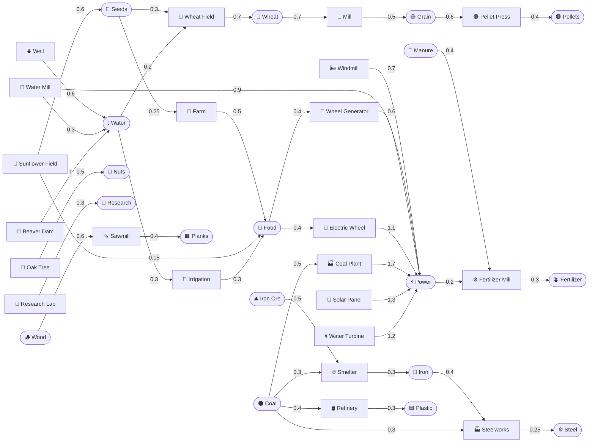
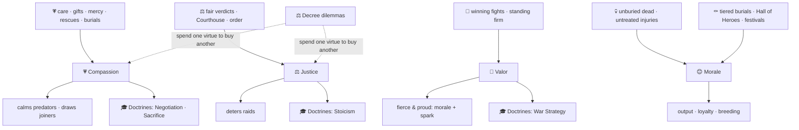
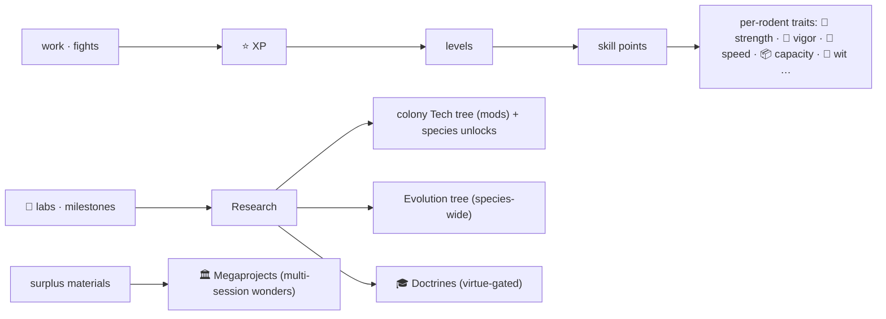

# 🐹 Neuroster — Systems & Flow Map

> **Auto-generated** from [`src/config.js`](./src/config.js) by
> [`tools/gen_systems.mjs`](./tools/gen_systems.mjs) — run `node tools/gen_systems.mjs`
> to refresh after a content change. It maps how **resources**, **structures**,
> **animals** and **skills** connect, and tabulates the **quantities** each
> structure costs / consumes / produces (use it for balancing). The conceptual
> diagrams (virtues, progression) are hand-authored at the bottom.

GitHub renders the Mermaid diagrams below. This map is meant to be folded into
the in-game **Help / How-to-Play** (icons + colour) as it firms up.

## 1. Resource flow (what makes what)

Boxes are **structures**; rounded nodes are **resources**. An arrow into a
structure is an input it consumes; an arrow out is what it produces.

_Raw materials (🪵 wood, 🪨 stone, ⛰️ ore, ⚫ coal, 🌱 seeds, 💧 water) are gathered
from world nodes by rodents (trees/rocks/bushes) or **Mines** (ore/coal); 💩 manure
comes from droppings (Composter) & burrow cleaning; ⚡ power from wheels/wind/water/coal._

## 1b. Sources — where each resource comes from

| Resource | Sources (raw + structures) |
|---|---|
| 🪵 Wood | gathered from 🌳 tree nodes (Beavers keep their own store) |
| 🪨 Stone | gathered from 🪨 rock nodes |
| ⛰️ Iron Ore | dug from ⛰️ ore seams by a **Mine** |
| ⚫ Coal | dug from ⚫ coal seams by a **Mine** |
| 🌱 Seeds | gathered from 🌳 bushes; 🌻 Sunflower Field |
| 💧 Water | rain/storms (more with 🛢️ Cisterns); rivers/ponds; ⛲ Well; 🛞 Water Mill; 🦫 Beaver Dam |
| 🌾 Food | starting stores; foraged; squirrel gifts; 🌾 Farm; 🌻 Sunflower Field; 🚿 Irrigation |
| 🌾 Wheat | 🌾 Wheat Field |
| 🟡 Grain | 🏯 Mill |
| 🟤 Pellets | 🟤 Pellet Press |
| 🌰 Nuts | 🌰 Oak Tree |
| 💩 Manure | droppings → ♻️ Composter; cleaning a burrow/house |
| 🪴 Fertilizer | ⚙️ Fertilizer Mill |
| 🟫 Planks | 🪚 Sawmill |
| 🔩 Iron | 🔥 Smelter |
| ⚙️ Steel | 🏭 Steelworks |
| 🟦 Plastic | 🛢️ Refinery |
| ⚡ Power | 🌬️ Windmill; 🛞 Water Mill; 🎡 Wheel Generator; 🔌 Electric Wheel; 🏭 Coal Plant; 🔆 Solar Panel; 🌀 Water Turbine |
| 🔬 Research | 🔬 Research Lab |

## 2. Structures — cost / consumes / produces (balancing)

### Automation

| Structure | Cost | Consumes | Produces | Effect |
|---|---|---|---|---|
| 🌬️ Windmill | 🪵 wood 30, 🟫 planks 8 | — | ⚡ power 0.7 |  |
| 🛞 Water Mill | 🪵 wood 32, 🟫 planks 10, 🪨 stone 8 | — | ⚡ power 0.9, 💧 water 0.3 | build near water |
| 🎡 Wheel Generator | 🪵 wood 35, 🟫 planks 5 | 🌾 food 0.4 | ⚡ power 0.6 |  |
| 🔌 Electric Wheel | 🟫 planks 20, 🔩 iron 15 | 🌾 food 0.4 | ⚡ power 1.1 | pollutes 0.4 |
| 🏭 Coal Plant | 🪨 stone 50, 🔩 iron 20 | ⚫ coal 0.5 | ⚡ power 1.7 | pollutes 2.2 |
| 🔆 Solar Panel | 🟫 planks 20, 🔩 iron 15, 🟦 plastic 8 | — | ⚡ power 1.3 | sun-driven |
| 🌀 Water Turbine | 🟫 planks 25, 🔩 iron 20 | — | ⚡ power 1.2 | dams the river; build near water |
| 🛞 Conveyor (Wood) | 🪵 wood 30, 🟫 planks 10 | — | — | auto-haul |
| 🟦 Conveyor (Plastic) | 🟦 plastic 20, 🟫 planks 10 | — | — | auto-haul |
| ⚙️ Conveyor (Metal) | 🟫 planks 20, 🔩 iron 20 | — | — | auto-haul |

### Defense

| Structure | Cost | Consumes | Produces | Effect |
|---|---|---|---|---|
| 🚧 Wooden Fence | 🪵 wood 10 | — | — | +2 defense |
| 🧱 Wall (Wood) | 🪵 wood 12 | — | — | tiered fort (HP, upgradeable) |
| 🗼 Watchtower | 🪵 wood 20, 🪨 stone 30 | — | — | +8 defense; vision / defense stances |
| 🛤️ Tunnel (Wood) | 🪵 wood 15, 🟫 planks 8 | — | — | tiered fort (HP, upgradeable) |
| 🌉 Bridge (Wood) | 🪵 wood 18, 🟫 planks 10 | — | — | tiered fort (HP, upgradeable) |
| 🦫 Beaver Dam | 🪵 wood 50, 🪨 stone 20 | — | 💧 water 1 | dams the river; build near water |
| ⚔️ Barracks | 🟫 planks 40, 🔩 iron 20 | — | — | +12 defense |
| 🌊 Levee | 🪨 stone 40, 🟫 planks 10 | — | — |  |
| 🏚️ Quake Shelter | 🪨 stone 35, 🟫 planks 20 | — | — |  |

### Extraction

| Structure | Cost | Consumes | Produces | Effect |
|---|---|---|---|---|
| ⛏️ Mine | 🪵 wood 40, 🟫 planks 10 | — | — | mines ore/coal |

### Food

| Structure | Cost | Consumes | Produces | Effect |
|---|---|---|---|---|
| 🌾 Farm | 🪵 wood 30 | 🌱 seeds 0.25 | 🌾 food 0.5 |  |
| 🌾 Wheat Field | 🪵 wood 35, 🟫 planks 10 | 🌱 seeds 0.3, 💧 water 0.2 | 🌾 wheat 0.7 |  |
| 🏯 Mill | 🪵 wood 30, 🪨 stone 30 | 🌾 wheat 0.7 | 🟡 grain 0.5 |  |
| 🟤 Pellet Press | 🟫 planks 30, 🔩 iron 15 | 🟡 grain 0.6 | 🟤 pellets 0.4 |  |
| ♻️ Composter | 🪵 wood 30, 🟫 planks 10 | — | — | droppings→manure |
| ⛲ Well | 🪵 wood 20, 🪨 stone 20 | — | 💧 water 0.6 | build near water |
| 🌰 Oak Tree | 🌱 seeds 14, 💧 water 8, 🪵 wood 6 | — | 🌰 nuts 0.5 | tree (forest) |
| 🌻 Sunflower Field | 🪵 wood 16, 💧 water 10 | — | 🌱 seeds 0.6, 🌾 food 0.15 |  |
| 🚿 Irrigation | 🟫 planks 15, 🪨 stone 15 | 💧 water 0.3 | 🌾 food 0.3 |  |

### Housing

| Structure | Cost | Consumes | Produces | Effect |
|---|---|---|---|---|
| 🕳️ Burrow | 🪵 wood 20 | — | — | +3 housing |
| 🏛️ Meeting Burrow | 🪵 wood 35, 🟫 planks 15 | — | — |  |

### Production

| Structure | Cost | Consumes | Produces | Effect |
|---|---|---|---|---|
| ⚙️ Fertilizer Mill | 🪵 wood 28, 🟫 planks 12, 🪨 stone 10 | 💩 manure 0.4, ⚡ power 0.2 | 🪴 fertilizer 0.3 |  |
| 🪚 Sawmill | 🪵 wood 40, 🪨 stone 10 | 🪵 wood 0.6 | 🟫 planks 0.4 |  |
| 🔥 Smelter | 🪵 wood 30, 🪨 stone 40 | ⛰️ ironore 0.5, ⚫ coal 0.3 | 🔩 iron 0.3 | pollutes 0.8 |
| 🏭 Steelworks | 🪨 stone 50, 🔩 iron 20 | 🔩 iron 0.4, ⚫ coal 0.3 | ⚙️ steel 0.25 | pollutes 1 |
| 🛢️ Refinery | 🪨 stone 40, 🔩 iron 20 | ⚫ coal 0.4 | 🟦 plastic 0.3 | pollutes 0.9 |
| 🔬 Research Lab | 🟫 planks 30, 🔩 iron 10 | — | 🔬 research 0.3 |  |
| 🏪 Trading Hut | 🪵 wood 40, 🟫 planks 20 | — | — |  |

### Storage

| Structure | Cost | Consumes | Produces | Effect |
|---|---|---|---|---|
| 📦 Storage Depot | 🪵 wood 25 | — | — | +200 storage |
| 🛢️ Water Cistern | 🪵 wood 26, 🟫 planks 8 | — | — | +300 storage |

### Wellbeing

| Structure | Cost | Consumes | Produces | Effect |
|---|---|---|---|---|
| 💉 Vet Clinic | 🟫 planks 25, 🔩 iron 10 | — | — | +4 health |
| ✝️ Dirt Graves | 🪵 wood 20, 🪨 stone 10 | — | — |  |
| 🪦 Stone Crypts | 🪨 stone 45, 🟫 planks 15 | — | — |  |
| 🏛️ Grand Mausoleum | 🪨 stone 80, 🔩 iron 30, 🟫 planks 30 | — | — |  |
| 🎠 Playground | 🪵 wood 30, 🟫 planks 10 | — | — | +6 fun |
| 🧸 Toy Box | 🪵 wood 14, 🌱 seeds 6 | — | — | +4 fun |
| 🎡 Fun Wheel | 🪵 wood 24, 🟫 planks 10 | — | — | +9 fun |
| 🌀 Hedge Maze | 🪵 wood 30, 🟫 planks 16, 🌱 seeds 12 | — | — | +14 fun |
| 🏥 Infirmary | 🟫 planks 20, 🔩 iron 5 | — | — | +6 health |
| 🏖️ Sand Bath | 🪵 wood 12, 🪨 stone 18 | — | — | +5 health |
| 🏡 Sanctuary | 🪵 wood 30, 🟫 planks 15, 🌱 seeds 10 | — | — | +3 health |
| 🌳 Plant Tree | 🌱 seeds 10, 💧 water 6 | — | — | tree (forest) |
| 🗿 Statue | 🪨 stone 40, 🟫 planks 10 | — | — | morale + compassion |
| ⚖️ Courthouse | 🟫 planks 30, 🪨 stone 25 | — | — |  |
| 🎖️ Hall of Heroes | 🪨 stone 50, 🟫 planks 25, 🔩 iron 10 | — | — |  |
| 🍞 Almshouse | 🪵 wood 25, 🟫 planks 12, 🌱 seeds 10 | — | — |  |
| 🚰 Auto-Waterer | 🟫 planks 15, 🔩 iron 5 | — | — | auto-water |
| 🏡 Caretaker's Hut | 🟫 planks 30, 🔩 iron 10, 🌾 food 20 | — | — | caretaker |
| 🍽️ Feeder | 🪵 wood 20, 🟫 planks 8 | — | — | auto-feed |

## 3. Resources

| Resource | Kind | Notes |
|---|---|---|
| 🪵 Wood | raw |  |
| 🪨 Stone | raw |  |
| ⛰️ Iron Ore | raw |  |
| ⚫ Coal | raw |  |
| 🌱 Seeds | raw |  |
| 💧 Water | raw |  |
| 🌾 Food | refined | food (nourish ×1) |
| 🌾 Wheat | refined |  |
| 🟡 Grain | refined | food (nourish ×1.5) |
| 🟤 Pellets | refined | food (nourish ×2.4) |
| 🌰 Nuts | refined |  |
| 💩 Manure | raw |  |
| 🪴 Fertilizer | refined |  |
| 🟫 Planks | refined |  |
| 🔩 Iron | refined |  |
| ⚙️ Steel | refined |  |
| 🟦 Plastic | refined |  |
| ⚡ Power | abstract | not stored (pool) |
| 🔬 Research | abstract | not stored (pool) |

## 4. Animals

### Rodent species (your colony)

| Species | Speed | Carry | Mine | Build | Special |
|---|---|---|---|---|---|
| 🐹 Hamster | 1 | 5 | 1 | 1 | All-round worker |
| 🐹 Guinea Pig | 0.8 | 4 | 0.6 | 1 | Burly guard/soldier — runs wheels & fights off raiders (power ×2, def 3/atk 3) |
| 🦡 Gopher | 1 | 6 | 1.3 | 1.6 | Tunnels underground to repair & dig fast (repair ×2) |
| 🐭 Gerbil | 1.6 | 8 | 0.8 | 1 | Fast hauler; speeds conveyors |
| 🐁 Mouse | 1.4 | 3 | 0.7 | 1 | Lookout: warns of flying predators (research ×1.5) |
| 🐀 Rat | 1.1 | 9 | 0.9 | 1 | Swarm defense vs ground predators |
| 🦫 Beaver | 0.7 | 6 | 1.4 | 2 | Builds dams; speeds building; flood defense |

- **🦫 Beavers** also build Dams and keep their **own wood store** (hamsters tap it
  when wood is low — over-tap them and they sabotage the water works).
- **🐿️ Squirrels** are drawn by **🌰 Oaks & Nuts**: a kind colony trades, a hoard gets
  raided; friendly squirrels speed up timber builds.

### Neighbouring factions (trade / raid)

| Faction | Covets | Offers |
|---|---|---|
| 🐿️ Squirrels | 🌾 Food, 🌱 Seeds, 🟤 Pellets | 🟫 Planks |
| 🐿️ Chipmunks | 🌱 Seeds, 🟡 Grain, 🌾 Wheat | 🪨 Stone |
| 🐭 Field Mice | 🌾 Wheat, 🟡 Grain, 🌾 Food | 🔬 Research |
| 🐀 Pack Rats | 🔩 Iron, 🟫 Planks, 🟤 Pellets | ⚫ Coal |

## 4b. Modifiers (+ / −) — what tunes each output

The sim multiplies a base rate by these. Use it to balance: if an output feels
off, this is the list of levers acting on it. (Hand-authored from the per-tick
order in [`src/economy.js`](./src/economy.js); keep it in sync as systems change.)

| Output | Raised by (+) | Lowered by (−) |
|---|---|---|
| 🌾 Farm food yield | fertile ground (near water), stored 🪴 fertilizer, post-flood silt, leadership (Town Hall), spring/harvest season | 🏭 pollution (smog), drought/snow/winter, distraction |
| ⚙️ Production / refining (all) | leadership, megaprojects (prodMul), doctrines, abundant ⚡ power | builders busy (labour diverted), low wellbeing/needs, power shortage, distraction (play wheels/maze) |
| ⛏️ Gather / mine rate | per-rodent 💪 strength & 🪨 mine traits, levels, species mine stat, evolutions, day/night alignment | few free hands (builders busy), low needs/health, sickness (wet-tail) |
| 🍗 Per-rodent need drain | — (faster) hot/humid/winter weather, crowding | 🔋 Vigor trait, needRetain evolutions, feeders/waterers/caretakers |
| 💧 Water flow | 🛢️ Cisterns (rain capture), rain/storm weather, ⛲ Wells / 🛞 Water Mills | 🦫 dams (upstream), grumpy beavers (sabotage), drought |
| ⚡ Power | wheels, 🌬️ Windmill (wind/storm), 🛞 Water Mill, 🔆 Solar (sun), 🏭 Coal Plant | night/fog/snow (solar), calm (windmill), upstream dams (hydro) |
| 🛡️ Defense | walls/fences/towers (DEFEND), guard species (guinea pig), 🏛️ Citadel, War doctrines | wood forts burn/wash (wildfire/flood), damaged HP |
| 👶 Breeding | burrows, leadership, Sacrifice doctrine, megaprojects, spring | degraded/dirty burrows, resentment (too-lavish Town Hall), winter, low food |
| 😊 Morale | tiered burials, Hall of Heroes, festivals, statues, high 🦁 Valor, leadership, Almshouse goodwill | unburied dead, untreated injuries, lethal defense, militarised (DEFEND) towers, ignored decrees |
| 🏭 Pollution | coal industry (coal plant, smelter, steelworks, refinery, electric wheel) | 🌳 forests (scrub), natural decay, clean power |
| 🐿️ Squirrel pressure | 🌰 oaks, a 🌰 nut hoard | (spend nuts via trade; clears after a visit) |
| 🦫 Beaver mood | keeping colony 🪵 wood stocked (store left to rebuild) | tapping their store too often (chronic wood shortage) |

## 5. Virtues, morale & doctrines

## 6. Progression & skills

---

_Generated from `src/config.js` — 59 structures, 19 resources, 7 species. Run `node tools/gen_systems.mjs` to refresh._
